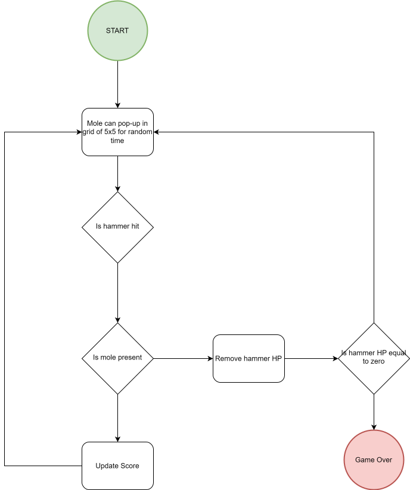
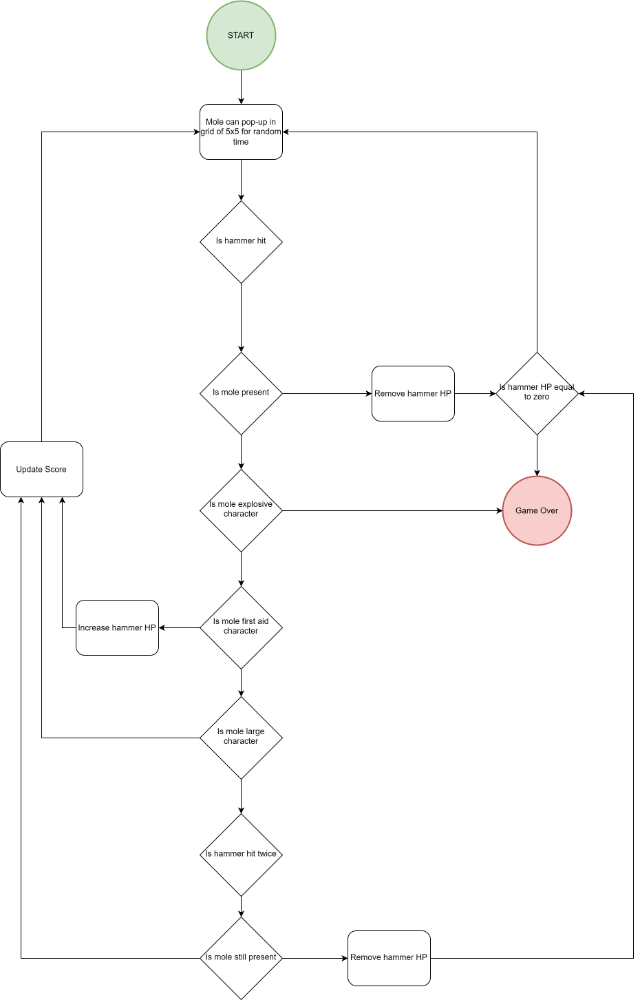

# Whack-A-Mole

Whack-A-Mole is an interactive frontend website created to meet the criteria of the Code Institute Milestone Project 2. \
The website hosts a game of Whack-a-Mole that in a random time has a random number of moles pop up for which the user has to click. Everytime a mole is hit the user score increases. If a mole is not present and the user clicks the hammer HP decreases, if it hits zero the game ends.

View Repository in GitHub Pages:\
https://github.com/mparker-landt/Milestone_Project_2

View Website Link:\
https://mparker-landt.github.io/Milestone_Project_2/

Author: Marcus Parker\
Github: [mparker-landt](https://github.com/mparker-landt)

## Table of Contents
+ [UX](#ux "UX")
  + [User Demographic](#user-demographic "User Demographic")
  + [User Stories](#user-stories "User Stories")
    + [First time User Stories](#first-time-user-stories "First time User Stories")
    + [Returning User Stories](#returning-user-stories "Returning User Stories")
  + [Design](#design "Design")
    + [Wireframes](#wireframes "Wireframes")
    + [Flow Charts](#flow-charts "Flow Charts")
    + [Colour Scheme](#colour-scheme "Colour Scheme")
    + [Typography](#typography "Typography")
    + [Images](#design "Design")
+ [Features](#features "Features")
  + [Existing Features](#existing-features "Existing Features")
    + [Header and Navigation Bar](#header-and-navigation-bar "Header and Navigation Bar") 
    + [Footer](#footer "Footer")
  + [Future Features](#future-features "Future Features")
+ [Resources](#resources "Resources")
  + [Technologies](#technologies "Technologies")
  + [External Resources](#external-resources "External Resources")
+ [Testing](#testing "Testing")
  + [Performance Testing](#performance-testing "Performance Testing")
  + [HTML Validator Testing](#html-validator-testing "HTML Validator Testing")
  + [CSS Validator Testing](#css-validator-testing "CSS Validator Testing")
  + [JS Testing](#js-testing "JS Testing")
  + [User Story Testing](#user-stories "User Story Testing")
    + [First time User Goals](#first-time-user-goals "First time User Goals")
    + [Returning User Goals](#returning-user-goals "Returning User Goals")
+ [Deployment & Development](#deployment--development "Deployment & Development")
+ [Credits and Aknowledgements](#credits-and-aknowledgements "Credits and Aknowledgements")

## UX
### User Demographic
The game was designed for any user from age 5 onwards. Although probably more appealing to younger players it can be played by any age and offers a simple fun time to all.
### User Stories
#### First time User Stories:
* As a first time visitor I want to quickly understand the purpose of the website.
* As a first time visitor I want to learn how to play the game and easily start a new game. 
* As a first time visitor I want to be able to find the author and details for the creator of the site.
#### Returning User Stories:
* As a returning user I want to start playing the game quickly and efficiently.
* As a returning user I want to be able to play the game to beat my previous high score.
* As a returning user I want to be able to see if there have been any updates or changes to the game.

### Design
The website was designed to be a single-page site developed first for mobile size screens. As the game is quite intuitive and easy to learn the UI design was kept minimal and any visual aspects kept to a minimum.
Although designed first for smaller screens with touch capability the game plays on larger screens with a mouse or touchpad.
#### Wireframes
Wireframes were created with draw.io

#### Flow Charts

#### Colour Scheme
For easy visuals bold colours were used:
* #04AA6D - Used for the header, score and mole tap feedback in the game
* #8DD359 - Used for background of the game area
* #808080 - Used for the footer and generic buttons and borders
* #339DFF - Used for the main button to start/stop the game
* #FF0000 - Used for hammer HP and missed mole tap feedback

#### Typography
The font used for this project was [Anta](https://fonts.google.com/specimen/Anta).
This is a modern font family designed for screen publications. Due to the easy readibility and modern glyph shapes this was used to match the game aspect. 
#### Images
For this project no opensource images were used. Instead custom images were created, compressed and imported into the game.
A full list of the images provided:

* Mole Hole

* Normal Mole

* Gameover Mole

* Buff Mole

* Medic Mole

* Miner Mole

* Bomb Mole

* For the favicon the Normal Mole image was used

Acknowledgements to the artist are found in the Credits section.

## Features
### Base Game Features
* Start/Stop Game Button - Change visual on tapped, Reset counters, Hover effect on larger screens, Pointer change to show clickable

* Instructions Button and Popup, Pointer change to show clickable

* Score and HP Counters - Border flash on change

* Game Area - Tap feedback, Mole goes when tapped

* Gameover Popup - Stops game

* Modals - Close Button, Header/ body and footer, Body greyed out and pressable  

### Advanced Game Features
* Initially slow but speeds up as score increases
* Different Mole Charaters
* Different speeds
* More moles appear, from 1 to 3 at a time

### Design Features
* Header

* Footer, Pointer change to show clickable

* Game Controls

* Score Board

* Game Area - Change to horizontal grid

### Future Features
* More characters
* Potentially a score to reach to finish the game?
* Collapsed footer that can be dragged up to see the information
* Animations for the moles
* Tutorial

## Resources
### Technologies
HTML\
CSS\
JavaScript\
Jquery\
NPM\
Jest
### External Resources
Google Fonts\
W3 Schools\
Draw.io\
Stack Overflow

## Testing
### Performance Testing
TBC
### HTML Validator Testing
TBC
### CSS Validator Testing
TBC
### JS Testing
TBC
### User Story Testing
#### First time User Goals:
TBC
#### Returning User Goals:
TBC

## Deployment & Development
This project was developed in an environment consisting of the tools:
- VS Code - IDE to develop and view the code.
- Sourcetree to Pull, Reset, Commit and Push the code.
- Github & Git - Version and Source control to save the code and see the history. 
- Firefox Web Browser - Used to view and debug the code.
- Chrome Web Browser - Used to view and debug the code.

The base for the project was created using the Code Institute template:\
https://github.com/Code-Institute-Org/ci-full-template

The project is deployed on Github:\
https://github.com/mparker-landt/Milestone_Project_2

To acquire the code:
- Log into Github
- Navigate to the project link
- On the project page click the Code button
- Clone or download the zip of the code
- Open the project in an environment of your choice

Forking the repository

Cloning the repository
 

## Credits and Aknowledgements
TBC:
* Mentor - Providing help throughout the project and giving direction and help where needed.
* RH - Providing the art/images for the game and giving design feedback to improve the website.
* CR - Helping with user testing of the game and finding bugs.

Modals - https://www.codexworld.com/code-snippets/modal-popup-with-html-css-jquery/
Grid CSS - https://www.joshwcomeau.com/css/interactive-guide-to-grid/
Footer - https://codepen.io/philknowles/pen/WrYRvG
Tap - 
