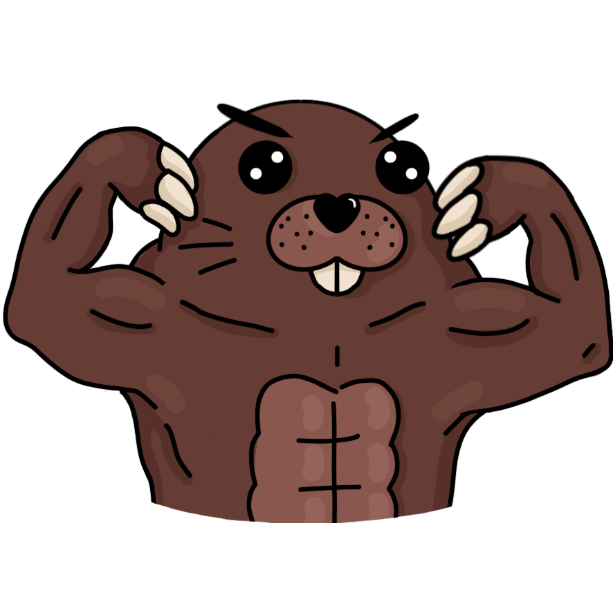
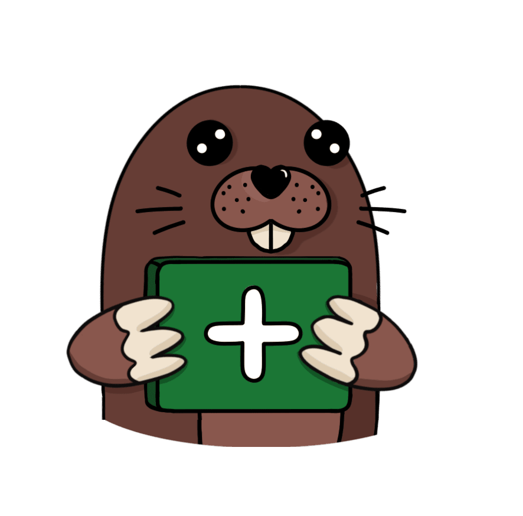
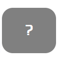
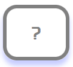
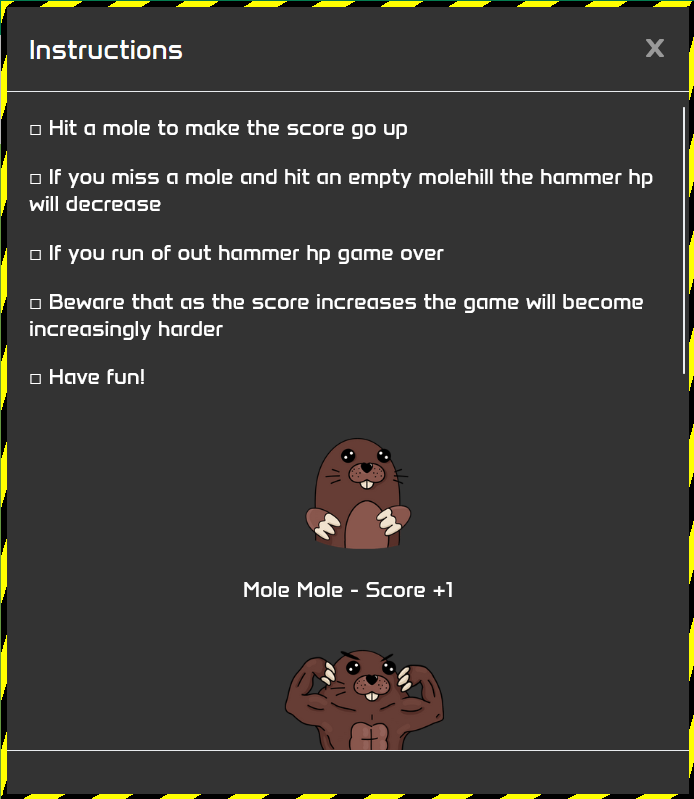
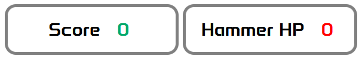
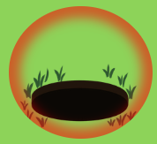
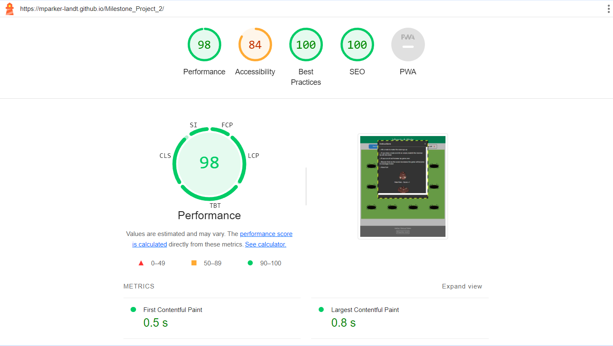

# Whack-A-Mole

Whack-A-Mole is an interactive frontend website created to meet the criteria of the Code Institute Milestone Project 2. \
The website hosts a game of Whack-a-Mole that has a mole pop-up in a random amount of time in a random mole hole for which the user has to click. Every time a mole is hit the user score increases. If a mole is not present and the user clicks the hammer HP decreases, if it hits zero the game ends.

Different mole characters appear after a certain score is reached that can affect the score and hammer HP differently.

View Repository in GitHub Pages:\
https://github.com/mparker-landt/Milestone_Project_2

View Website Link:\
https://mparker-landt.github.io/Milestone_Project_2/

Author: Marcus Parker\
Github: [mparker-landt](https://github.com/mparker-landt)

## Table of Contents
+ [UX](#ux "UX")
  + [User Demographic](#user-demographic "User Demographic")
  + [User Stories](#user-stories "User Stories")
    + [First time User Stories](#first-time-user-stories "First time User Stories")
    + [Returning User Stories](#returning-user-stories "Returning User Stories")
  + [Design](#design "Design")
    + [Wireframes](#wireframes "Wireframes")
    + [Flow Charts](#flow-charts "Flow Charts")
    + [Colour Scheme](#colour-scheme "Colour Scheme")
    + [Typography](#typography "Typography")
    + [Images](#images "Images")
+ [Features](#features "Features")
  + [Base Game Features](#base-game-features "Base Game Features")
  + [Advanced Game Features](#advanced-game-features "Advanced Game Features")
  + [Design Features](#design-features "Design Features")
  + [Future Features](#future-features "Future Features")
+ [Resources](#resources "Resources")
  + [Technologies](#technologies "Technologies")
  + [External Resources](#external-resources "External Resources")
+ [Testing](#testing "Testing")
  + [Performance Testing](#performance-testing "Performance Testing")
  + [HTML Validator Testing](#html-validator-testing "HTML Validator Testing")
  + [CSS Validator Testing](#css-validator-testing "CSS Validator Testing")
  + [JS Testing](#js-testing "JS Testing")
+ [Known Bugs](#known-bugs "Known Bugs")
+ [Development & Deployment](#development--deployment "Development & Deployment")
  + [Development](#development "Development")
  + [Deployment](#deployment "Deployment")
+ [Credits and Acknowledgements](#credits-and-acknowledgements "Credits and Acknowledgements")

## UX
### User Demographic
The game was designed for any user from age 5 onwards. Although probably more appealing to younger players it can be played by any age and offers a simple fun time to all.
### User Stories
#### First time User Stories:
* As a first-time visitor I want to quickly understand the purpose of the website.
* As a first-time visitor I want to learn how to play the game and easily start a new game. 
* As a first-time visitor I want to be able to find the author and details for the creator of the site.
#### Returning User Stories:
* As a returning user I want to start playing the game quickly and efficiently.
* As a returning user I want to be able to play the game to beat my previous high score.
* As a returning user I want to be able to see if there have been any updates or changes to the game.

### Design
The website was designed to be a single-page site developed first for mobile size screens. As the game is quite intuitive and easy to learn the UI design was kept minimal and any visual aspects kept to a minimum.
Although designed first for smaller screens with touch capability the game plays on larger screens with a mouse or touchpad.
#### Wireframes
Wireframes were created with draw.io.\
As the wireframes were made at the start of the project well in advance there were several differences and mistakes but generally they were followed throughout the project to bring it to completion.

#### Flow Charts

#### Colour Scheme
For easy visuals bold colours were used:
* #04AA6D - Used for the header, score and mole tap feedback in the game
* #8DD359 - Used for background of the game area
* #808080 - Used for the footer and generic buttons and borders
* #339DFF - Used for the main button to start/stop the game
* #FF0000 - Used for hammer HP and missed mole tap feedback

#### Typography
The font used for this project was [Anta](https://fonts.google.com/specimen/Anta).
This is a modern font family designed for screen publications. Due to the easy readability and modern glyph shapes this was used to match the game aspect. 
#### Images
For this project no opensource images were used. Instead custom images were created, compressed and imported into the game.
A full list of the images provided:

* Mole Hole

* Normal Mole

* Gameover Mole

* Buff Mole

* Medic Mole

* Miner Mole

* Bomb Mole

* For the favicon the Normal Mole image was used

Acknowledgements to the artist are found in the Credits section.

## Features
### Base Game Features
* Start/Stop Game Button - This was the main control to start or stop the game.\
On hover or press the button visuals changed to show the button and game was active. On larger screens with a mouse the mouse icon also changes to a pointer to show that the button is clickable.

* Instructions Button and Pop-up - This feature was made small and unobtrusive to not take away from the game.\
On hover the button visuals changed and on larger screens the mouse icon changes to a pointer.\
When clicked an instructions pop-up appears with rules for the game and explanations about the different mole characters. The modal could be closed with a close butt1on click or selecting anywhere outside the pop-up box.
Due to user feedback the instructions were made to start off as visible on entering the webpage. 

* Score and HP Counters - These icons started off with initial values on a new game. As they increased or decreased the border of the counter boxes flashed red or green corresponding to them decreasing or increasing respectively.

* Game Area - The game area was where the main action of the webpage occurred when a game was started.\
On tapping feedback was given via different circles appearing with red, green and grey colours corresponding to misses, hits and needing another tap respectively.\
Different mole characters could pop-up randomly in any hole and stay active for a different amount of time depending on the mole character.

* Game Over Pop-up - On reaching a hammer HP of 0 or hitting a game over mole character the game over pop-up would appear. This stopped the game but allowed it to be restarted with initial scores easily via a restart button.
The pop-up modal could be closed via a close button or selecting anywhere outside the po- up box.

### Advanced Game Features
* Initially slow but speeds up as score increases
* Beginner grace period - At the start of a new game the first 5 moles would only be the base mole character and start off staying active longer than usual. Past a score of 5 new mole characters would appear and past a score of 10 the time moles stayed active became less.
* Different Mole Characters - Initially the base game was created with only the base mole character. However for the advanced game different moles were added that affected the score and hammer HP in different ways.
* Different speeds - The different mole characters had different times of staying active based on their characters. This was to increase the difficulty of the game.

### Design Features
Whole Page - The webpage and game were primarily designed to be a single page in a view and not require any scrolling. For this reason it was targeted towards a tap mobile first approach but was made functional on larger screens.

* Header - The header of the webpage was made to be as simple and visually appealing as possible. Due to there being no need for navigation the only use was for the title of the webpage.

* Footer - The footer was made the generic colour of the webpage and not the same as the header to not visually get in the way of the webpage. It was used to display the author and link to authors Github profile.
On smaller screens the footer was made collapsible to maximise the area for the game.

* Game Controls - The Game Controls were made as simple as possible. The main control for the game was made bold to capture attention. the instructions for the game were made to be unobtrusive and easy and quick to use.

* Score Board - The score board was kept simple and close to the game area so users could quickly and easily see their score and hammer HP at a glance. On the values changing in the scoreboard the borders of the values flashed an appropriate colour to show the values increasing or decreasing.

* Game Area - The game area was made a bright colour to accurately show the grid of images that the game was performed upon. However it was made light green to correspond to grass and maximise the nature feel of the game. On mobile and smaller screens the grid was displayed in a vertical 3x4 grid, however on larger screens the grid switched to 4x3 layout to maximise space usage as much as possible.

* Modals - The modals were made grey to match the colour of generic aspects of the page. However the border was made black and yellow to give the characteristic of warning tape and make the pop ups stand out.\
The modal was split into a header with title and close icon. This was separated from the body with a line divide. 
The main content of the body was contained with the body of the modal, for modals with large amounts of content the body was made scrollable rather than let the pop-up increasing in height and potentially affecting the page underneath.
The modal also included a footer divided from the body and its content by another line break. This was to increase the visual aspect as well as be potentially used in the future for other features.

### Future Features
Although complete as is future features were explored and considered viable. These included:
* More moles could be activated as the score progresses.
* More characters could be added to the game.
* Score shown in game over modal so players can see their final score and restart immediately.
* Animations for the moles being activated.
* A tutorial on a new start to the game and/or activated via a separate button for users to interactively learn about the mole characters and their aspects.

## Resources
### Technologies
- [HTML](https://en.wikipedia.org/wiki/HTML5)
- [CSS](https://en.wikipedia.org/wiki/CSS)
- [JS](https://en.wikipedia.org/wiki/JavaScript)
- [Jquery](https://jquery.com)
- [NPM](https://www.npmjs.com)

### External Resources
- [Font Awesome](https://fontawesome.com/) - Used to acquire icons for the project.
- [Google Fonts](https://fonts.google.com/) - Used to acquire the fonts for the project.
- [W3 Schools](https://www.w3schools.com/) - Used to learn about certain code aspects and how to use them.
- [Stack Overflow](https://stackoverflow.com/) - Used to problem solve the code and solve issues.
- [Draw.io](https://www.drawio.com/) - Used to create the wireframes and flow charts for the project.
- [An Interactive Guide to CSS Grid](https://www.joshwcomeau.com/css/interactive-guide-to-grid/) - Used to learn and use the grid element in HTML and CSS.

## Testing
Testing of the website was performed throughout its development period. The testing was performed primarily on Mobile Firefox although Google Chrome, Firefox and IOS was also tested on both mobile and desktop devices.\
For the HTML and CSS testing was done with Google Chrome and Firefox Development Tools.\
For JavaScript functionality testing a small group of friends and colleagues were used as a test group to provide feedback and notify about bugs that could have been missed.
### Performance Testing
The website performance was tested using Google Chrome Developer Tools Lighthouse feature.
For the webpage the Performance, Best Practices and SEO were all high with scores of 98 and 100 respectively.
The Accessibility score was not as high with a value of 84. 

### HTML Validator Testing
https://validator.w3.org/

Each HTML page was validated using the online HTML validator.\
There were no errors and only information sections which could be safely ignored.

### CSS Validator Testing
https://jigsaw.w3.org/css-validator/

The CSS page was validated using the online CSS validator. There were no errors reported. 

There were 24 warnings that all reported the same type of warning were the CSS was a vendor extension. These could be ignored as the CSS was inputted to improve visual aspects and functionality on different devices.

### JS Testing
https://jshint.com/

The JavaScript for the project was tested mainly by user testing and direct feedback. Console logs were used throughout development to understand the logic of what was happening when using the browser development tools.
The JavaScript code was also put into JS Hint to acquire more metrics and find and possible warnings and errors.

The code had 27 warnings, mostly to do with ES6 standard. All of these could be safely ignored and be certain they would not affect functionality of the webpage.

The code had one undefined variable. This however was due to the use of JQuery throughout the project which the JS Hint did not understand and therefore was not a problem.

There were 11 unused variables. However these were called with click events from the HTML file and therefore were used and needed for the webpage to function.

## Known Bugs
Although testing was performed throughout the project a small number of known bugs remained that could be potentially fixed.
These were at time of submission of the project;
* Footer drop-up arrow not changing to a drop-down when the collapsible footer is opened.
* On Google Chrome mobile devices the game area flashes whenever a mole is clicked.
* If restart is pressed in the game over pop-up whilst a mole from the previous game is still active a new game will start with 2 moles activating in random holes instead of 1.
* If the start and stop button were pressed quickly enough several games were started with several moles activating in random holes instead of 1.
* On Apple small screens the UI layout is squished and is not visually appealing.

## Development & Deployment
### Development
This project was developed in an environment consisting of the tools:
- VS Code - IDE to develop and view the code.
- Sourcetree to Pull, Reset, Commit and Push the code.
- Github & Git - Version and Source control to save the code and see the history. 
- Firefox Web Browser - Used to view and debug the code.
- Chrome Web Browser - Used to view and debug the code.

The base for the project was created using the Code Institute template:\
https://github.com/Code-Institute-Org/ci-full-template

The project is deployed on Github:\
https://github.com/mparker-landt/Milestone_Project_2

As the project progressed a second branch was used to develop on before merging back into the main branch. This was to have an active project that was reliable and could be used as a secure branch to develop from.

To acquire the code:
- Log into Github
- Navigate to the project link
- On the project page click the Code button
- Download the zip of the code
- Open the project in an environment of your choice

Forking the repository
- Log into Github
- Navigate to the project link
- On the project page click the Fork button
- Clone or download the zip of the code
- Open the project in an environment of your choice

Cloning the repository
- Log into Github
- Navigate to the project link
- On the project page click the Code button
- Copy the HTTPS or SSH link as preferred
- Clone the project using the link with the tool of your choice (Git Terminal, Github Desktop, Sourcetree etc)

### Deployment
The website was deployed live using Github and the Repository Pages in Settings.

## Credits and Acknowledgements
With special thanks to:
* Lauren-Nicole Popich - Mentor from the Code Institute who provided help throughout the project and was always available for support.
* Martina Terlevic - A mentor from the Code Institute who helped at the end of the project and gave some final tips.
* Renske Hoste - Providing the art/images for the game and giving design feedback to improve the website.
* Cat Rogers - Helping with user testing of the game and finding bugs.

Extra credit and acknowledgement goes to:
* https://www.codexworld.com/code-snippets/modal-popup-with-html-css-jquery/\
This was used and adapted upon to create the pop-up modals for the website.

* https://codepen.io/philknowles/pen/WrYRvG\
This was used for the collapsible footer on smaller screens for the website and had minor aspects changed to match the visuals of the colour scheme.
